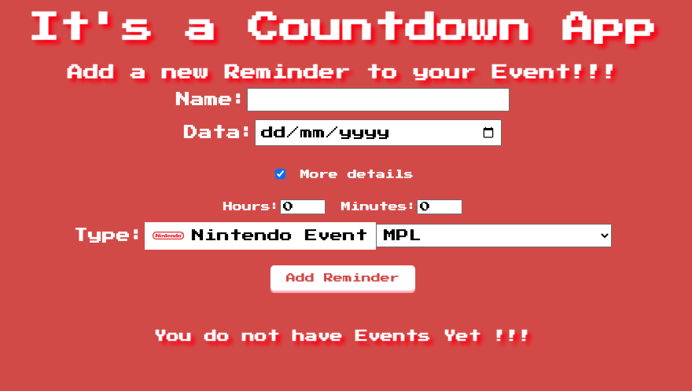
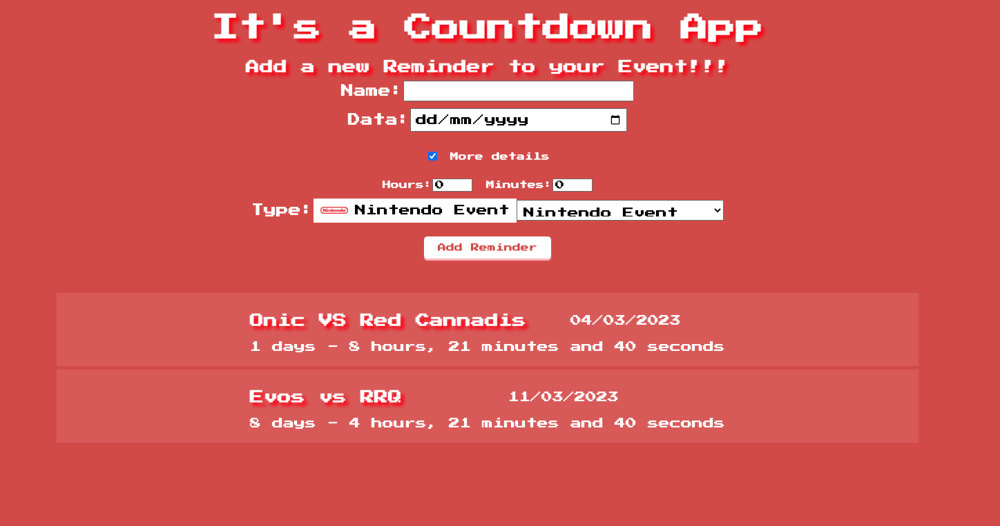

<h1>
  
  Event Countdown App
</h1>

  You can see the proposal of this application here: 
   <a href="https://github.com/florinpop17/app-ideas/blob/master/Projects/1-Beginner/Countdown-Timer-App.md">Countdown-app</a>

<h2>Screeenshots</h2>

Inital Screen

With Events

